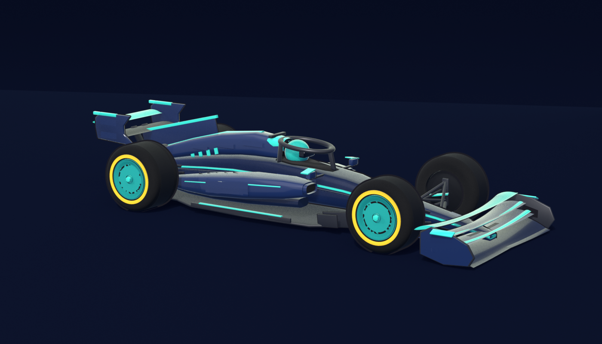
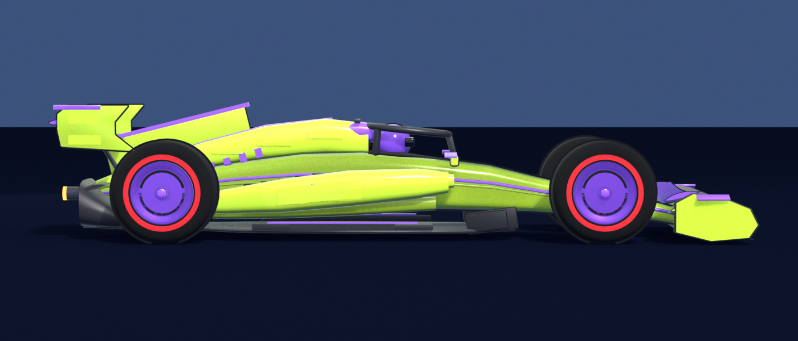
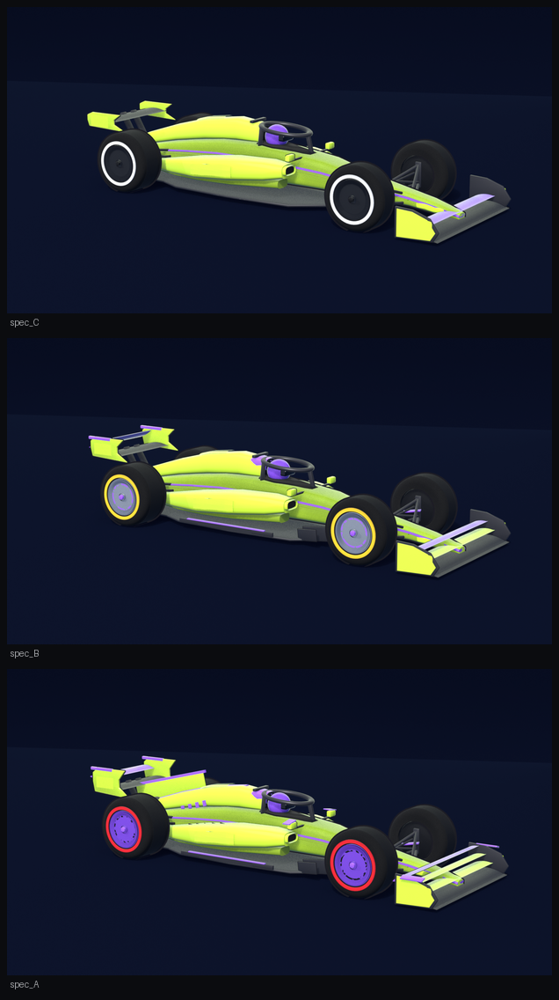
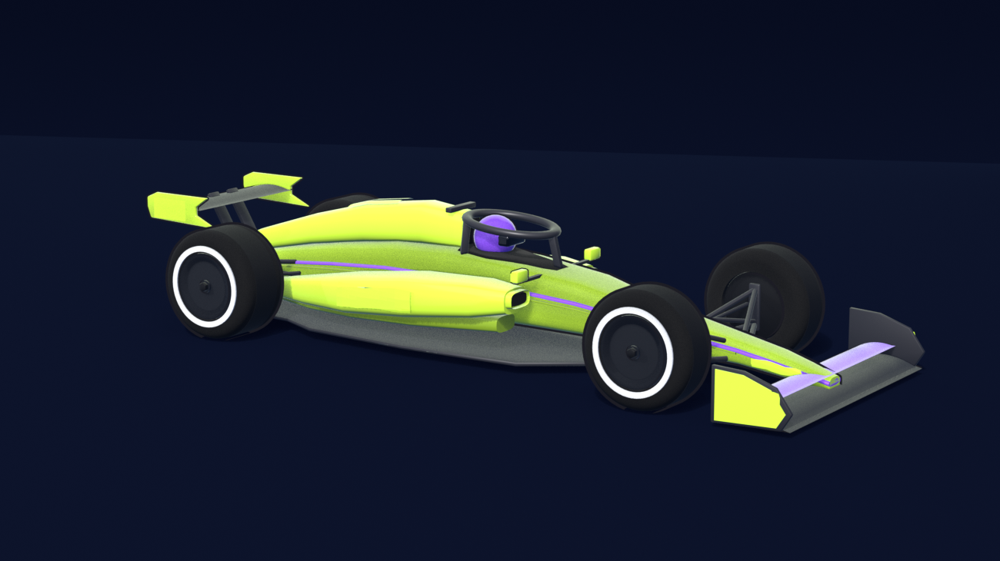
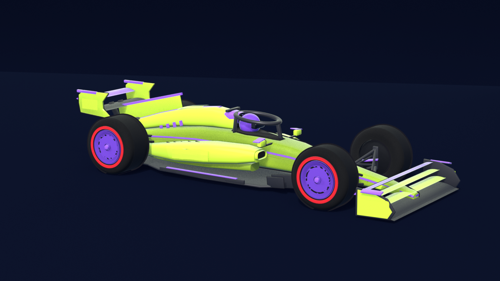
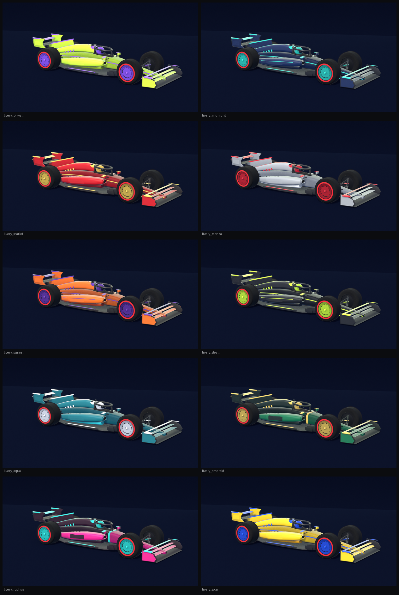
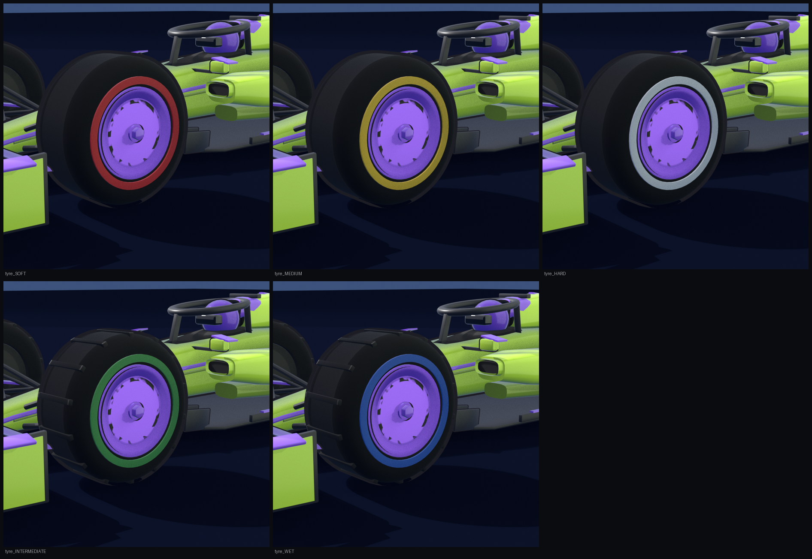

# Pit Wall — Design System ("Night Circuit")

**Estetik:** Yatay (landscape) pit-wall konsolu — grafit-siyah zemin üzerinde katı, yükseltilmiş paneller ve TEK baskın **acid-lime** vurgu (`#D4FF3D`), menekşe (`#9B5CFF`) gradyan partneri. Teal / amber / pembe yalnızca anlam taşır (uyum, uyarı, tehlike). Referans: `F1 Game Mobile App Design/Pit Wall - Horizontal Shell.dc.html`.

Bu doküman tasarım kararlarını **koddaki karşılıklarıyla** birlikte listeler. Token'lar `mobile/src/theme/` altında yaşar.

---

## 1. Renk Paleti

`mobile/src/theme/colors.ts`

| Rol | Token | Değer |
|-----|-------|-------|
| Ana arka plan (grafit) | `bgDeepSpace` | `#0B0C0F` |
| Yükseltilmiş panel | `bgElevated` | `#17181C` |
| İkinci yüzey / track | `bgSurface2` | `#1F2024` |
| Header & nav zemin | `bgSidebar` | `rgba(23,24,28,0.92)` |
| Ana vurgu (acid lime) | `accentLime` | `#D4FF3D` |
| İkincil vurgu (menekşe) | `accentViolet` | `#9B5CFF` |
| Vurgu zemin (soft) | `accentSoft` | `rgba(212,255,61,0.12)` |
| Lime üstünde metin | `onAccent` | `#14151A` |
| Teal (uyum / pozitif) | `electricCyan` / `matrixGreen` | `#2DD4BF` |
| Pembe (tehlike) | `neonCoral` | `#FF3B5C` |
| Amber (dikkat) | `solarAmber` | `#E3B341` |
| Metin ana | `textPrimary` | `#F5F6F2` |
| Metin ikincil | `textSecondary` | `#9A9C9F` |
| Metin üçüncül | `textTertiary` | `#5C5E63` |
| Kenarlık (default) | `borderDefault` | `rgba(255,255,255,0.08)` |
| Kenarlık (aktif) | `borderActive` | `rgba(212,255,61,0.5)` |

> Eski mavi tema token adları (`accentBlue`, `accentBlueLight`, `cyberPurple`, …) geriye dönük uyumluluk için alias olarak korunur ve yeni palete işaret eder.

**Ambient Mesh Gradient:** `AmbientBackground` atomu, Skia ile iki ağır bulanık (blur 90) blob'u ekran arkasında yavaşça (16 sn döngü) hareket ettirir; deep-space ekranların düz/boğucu görünmesini engeller.

Gradient setleri `gradients` altında: `accent`, `cyan`, `coral`, `green`, `purple`, `amber`, `ambient`.

---

## 2. Tipografi

`mobile/src/theme/typography.ts` — line-height'lar klostrofobiyi engellemek için **~%15 artırıldı** (`LINE_HEIGHT_BOOST = 1.15`).

| Kullanım | Font | Örnek variant |
|----------|------|---------------|
| Başlıklar (uppercase, tracking 1.5) | Barlow Condensed Bold/ExtraBold | `hero`, `pageTitle`, `sectionTitle`, `cardTitle` |
| Gövde / etiket | Inter Regular/Medium/SemiBold | `body`, `label`, `labelSmall` |
| Rakam / süre / para | JetBrains Mono Bold | `statLarge`, `stat`, `statSmall` |

Tüm metin tek bir primitive üzerinden geçer: `AppText` (`variant`, `color`, `uppercase`). Fontlar `app/_layout.tsx` içinde `@expo-google-fonts/*` ile yüklenir.

---

## 3. Yüzeyler, Boşluk, Glow

`mobile/src/theme/index.ts`

- `spacing` — 4 / 8 / 12 / 16 / 24 / 32 / 48
- `radius` — sm 8 · md 12 · lg 16 · xl 24 · pill 999 (kartlar 16)
- `layout` — headerHeight 56 · navCapsuleWidth 56 · navEdgeGap 12 · navItemSize 40
- `glow` — lime / violet / coral / teal (iOS shadow + Android elevation dışa parlama presetleri)

Paneller katıdır (`#17181C`): hairline kenarlık + 1px üst parlaklık çizgisi + yumuşak drop shadow. Ambient zeminde iki ağır bulanık blob (zeytin `#2A2C10` ve menekşe `#241A33` tonlu) yavaşça sürüklenir.

---

## 4. Bileşen Kütüphanesi (Atomic Design)

```
mobile/src/components/
├── atoms/
│   ├── Typography (AppText)        # tek tipli metin primitive
│   ├── GlassCard                   # frosted-glass yüzey (aktif=mavi glow)
│   ├── GlassButton                 # blur + gradient + spring press + haptic
│   ├── NeonStatChip                # +/- parlayan pill (5 ton)
│   ├── PulseDot                    # sıfıra yaklaştıkça hızlanan nabız
│   ├── LiquidProgressBar           # Skia sıvı gradient dolum barı
│   └── AmbientBackground           # Skia mesh gradient backdrop
├── molecules/
│   ├── CarStatCard                 # LED fit + LiquidProgressBar + RP maliyeti
│   ├── PilotAvatar                 # gradient ring + kategori rozeti
│   └── TimelineNode                # dikey enerji hattı + node
└── organisms/
    ├── NextRaceWidget              # geri sayımlı hero (pulse hızlanır)
    ├── RPEconomyCard               # devasa glow'lu RP sayacı
    └── NavShell                    # header + yüzen dikey nav kapsülü
```

Ekranlar: `features/manager/ManagerHomeScreen` · `features/raceweek/RaceWeekScreen` (session timeline, hava, pist uyumu, sıralama stratejisi) · `features/development/DevelopmentScreen` (araç önizleme + fabrika departmanları) · `features/common/PlaceholderScreen`.

---

## 5. Navigasyon (Landscape Shell)

`expo-router` (React Navigation v7 üzerine kurulu) + özel **NavShell**:
- **Header** tam genişliktedir, Dynamic Island'ın yatayda düştüğü kenarın insetini padding olarak emer.
- **Nav**, dikeyde ortalanmış **kompakt yüzen ikon kapsülüdür** — asla tam boy değil; island'ın OLMADIĞI kenara demirler (`useShellLayout` safe-area insetlerinden yönü çıkarır).
- Kapsül içinde 40px dairesel butonlar, JetBrains Mono 2 harfli glifler (RW · MG · GL · LG · PR); aktif buton acid-lime zemin + koyu glif.
- Sekmeler: **Race Week · Manager · Geliştirme · League · Profile** (varsayılan: Manager).
- Sadece esnek içerik island insetini ek padding olarak emer (`useShellLayout`); katı chrome donanımın üstüne asla binmez.
- Her sekme değişiminde `expo-haptics` selection feedback.

---

## 6. Geliştirme Metodolojisi & Stack

| Alan | Seçim |
|------|-------|
| Çatı | Expo SDK 57 · React Native 0.86 · React 19 · **New Architecture (Fabric)** |
| Navigasyon | expo-router (React Navigation v7) |
| Animasyon | react-native-reanimated v4 (worklets) |
| Grafik | @shopify/react-native-skia (liquid bar, ambient mesh, blur) |
| Liste | @shopify/flash-list |
| State | Zustand (`src/store/gameStore.ts`) |
| Veri çekme | TanStack Query (`src/lib/queryClient.ts`) |
| Haptics | expo-haptics (`src/lib/haptics.ts`) |
| Stil | **NativeWind v4 (Tailwind)** — `className`; dinamik/animasyonlu/Skia kısımlar `style` |
| Klasör | Feature-based / domain-driven (`src/features/*`) |

> **Stil katmanı — NativeWind v4:** Statik yerleşim/renk/kenarlık `className` ile yazılır. Tema token'ları `tailwind.config.js` içine taşındı (renkler `bg-deepspace`, `text-text-secondary`, `border-border-active`; fontlar `font-display`, `font-mono` vb.). Animasyonlu değerler (Reanimated), gradient (expo-linear-gradient), gerçek blur (expo-blur) ve Skia çizimleri `style`/prop üzerinden yönetilir — bunlar `className` ile ifade edilemez.
>
> **Sürüm notu:** NativeWind 4.2.6 çalışma zamanında Tailwind **v3** motoruna dayanır; Tailwind v4 henüz desteklenmediğinden `tailwindcss@3.4.19` (en son v3) sabitlendi.

---

## 7. Araç Modeli & Özelleştirme

Araç iki yerde yaşar ve **aynı kataloğu** paylaşırlar — biri değişince diğeri de değişmeli:

| Katman | Dosya | Rolü |
|--------|-------|------|
| 3D (Blender) | `tools/blender/build_toon_car.py` | 2026 nesli, stilize ("toy") model; uygulamanın kullandığı turntable. Geometri yardımcılarını ve stüdyoyu `build_f1_car.py`'den alır |
| 3D (eski) | `tools/blender/build_f1_car.py` | Gerçekçi oranlı ilk model; yardımcı fonksiyonlar ve render hattı burada |
| Katalog (Python) | `tools/blender/car_config.py` | Livery / bileşim / jant / spec |
| Katalog (TS) | `mobile/src/data/carCustomisation.ts` | Yukarıdakinin uygulama karşılığı |
| 3D görünüm | `mobile/src/components/organisms/CarTurntable.tsx` | Uygulamada döndürülebilir araç |
| 2D (Skia) | `mobile/src/components/organisms/CarIllustration.tsx` | Canlı özelleştirilen araç + sponsor çıkartmaları |

### Uygulamadaki 3D araç

Manager ve Geliştirme ekranlarındaki döndürülebilir araç, **Blender modelinin kendi
render'larıdır** — yörünge üzerinde 15°'de bir alınmış 24 kare:




```bash
# C / B / A spec'leri için üç sprite sheet → mobile/assets/car/turntable_{C,B,A}.png
./tools/blender/render_turntables.sh
```

Uygulama `CarTurntable`'a `spec` verir; spec harfi değişince sheet takas edilir ve
iki kare üst üste soldurulur. Her sheet'in kırpma oranı farklıdır; script'in
bastığı `aspect for CELL_ASPECT` değeri `CarTurntable.tsx` içindeki `SHEETS`
tablosuna yazılır.



Üç açılı hızlı önizleme için `tools/blender/preview_toon.sh` (hero · yan · ön + birleşik sheet).
Kontur çizgisi ters kabuk (Solidify) ile çizilir; `.glb` dışa aktarırken `--no-outline` verin.

Kareler tek bir sprite sheet'e paketlenir: hücre **982×417**, sheet **3928×2502** (4×6), 4,3 MB.

**Dört karar** (`CarTurntable.tsx`):

1. **Tek doku, tek çözümleme.** Her kare için ayrı `<Image>` yığmak kompozitörü her
   karede 24 katman harmanlamaya zorlar.
2. **Her şey `useAnimatedStyle` içinde UI thread'inde.** İndeksi `useState` ile sürmek her
   parmak hareketinde tüm bileşeni yeniden render ediyordu — ilk kasmanın sebebi buydu.
3. **İndeks ondalıklı, komşu iki kare çapraz geçişle harmanlanır**, böylece hareket
   15°'lik sıçramalar yerine sürekli okunur.
4. **Bırakınca en yakın tam kareye oturur.** Ortada bırakılırsa araç kalıcı %50 çift
   pozlamada kalıyor ve bulanık görünüyordu; çapraz geçiş geçici olmalı.

**Netlik.** Hücre 982 px genişliğinde ve ~373 punto olarak gösteriliyor, yani 3x ekranda
1119 px → **1,14 kat** büyütme. `make_sprite_sheet.py` her kareyi tüm karelerin **birleşik
alfa sınırına** göre kırpar; bu, render alanının ~%40'ını ölü kenar boşluğu yerine aracın
kendisine kazandırır (kırpma tüm karelerde aynı olduğu için araç kareler arası kaymaz).

Ölçümler (cihaz üzerinde): tam tur süpürmede **120 kare, 20 ms'yi aşan kare yok, ortalama
16,7 ms** (kilitli 60 fps). Kenar enerjisi 448 px hücreye kıyasla **1,24 → 2,77**.

Araç **kendiliğinden dönmez**: 30°'lik sabit vitrin çaprazında durur (`REST_FRAME`),
yalnızca kullanıcı sürüklediğinde döner.

> **Gerçek zamanlı 3D neden gönderilmedi.** `expo-gl` + three.js ile model gerçekten
> çalıştırıldı ve ekranda canlı döndü. Ama expo-gl bu kurulumda yüzeyi ancak **kare
> başına bloklayan bir senkronizasyon** (`gl.getError()`) yapıldığında sunuyor;
> `gl.flush()` yetmiyor. Senkronizasyon olmadan üç boyutlu sahne 60 fps'te çiziliyor
> (12 draw call, 30.788 üçgen sayılıyor) ama tek piksel ekrana gelmiyor; senkronizasyonla
> geliyor ama simülatörde **0,4 fps**'e düşüyor. Gerçek cihazda donanım GL'i ile farklı
> davranması muhtemel, ancak doğrulanamadığı için gönderilmedi.
>
> Model `tools/blender/out/f1-car.glb` olarak duruyor (`--export-glb`; materyal adları
> korunur, materyale göre 11 gruba birleştirilir) — gerçek cihazda denenmek istenirse hazır.
>
> Turntable takım livery'sinde pişmiştir; livery / bileşim / jant değişiklikleri 2D Skia
> aracında canlı yansır.

------|--------------|--------------|
| MOTOR | Egzoz borusu | Büyük egzoz · ısı dalgası · kaput ızgaraları |
| AERO | 2. kanat elemanı · barge board | 3. eleman · açık DRS · köpekbalığı yüzgeci · T-kanat · menekşe endplate |
| GRIP | Geniş lastikler | En geniş slickler · difüzör kanatçıkları · yarış jantı |

Blender nesne sayısı bunu doğrular: Spec C 93 → Spec B 119 → Spec A 152 parça.

> **Renk uyarısı:** Blender'ın Base Color soketi **lineer** bekler. Katalog renkleri sRGB
> saklandığı için `srgb_to_linear()` ile çevrilir; çevrilmezse canlı livery soluk pastele döner.
> Aynı sebeple view transform `Standard`, AgX değil.

Render:
```bash
./tools/blender/render_variants.sh out/ all        # specs · liveries · compounds · rims · sprites
```

Referans çıktılar:

| | |
|---|---|
|  |  |
| Spec C — tek elemanlı kanatlar, grafit blade jant, HARD (beyaz) | Spec A — 3 elemanlı ön kanat, açık DRS, yüzgeç, T-kanat, SOFT (kırmızı) |


*Yedi livery; `accent` jant her livery'ye göre çözümleniyor.*


*Beş bileşim: SOFT kırmızı · MEDIUM sarı · HARD beyaz · INTERMEDIATE yeşil (dişli) · WET mavi (dişli).*

## 8. Yükseltme Anı (animasyon + ses)

Yükseltme satın alındığında `CarUpgradeStage` bir **tamir vuruşu** oynatır: havalı anahtar
çalışır, çalışılan bölgeden kıvılcım fışkırır, gövde vurgu rengiyle parlar ve yeni parça
banner'da isimlendirilir. Ses zamanlamayı yönetir — `sfx.playUpgradeSequence()` "parça oturdu"
vuruşunun kaç ms sonra geleceğini döndürür, flaş ve haptik ona göre planlanır.

Ses efektleri `tools/audio/make_sfx.py` ile sentezlenir (lisanslı sample paketi yok):
`wrench.wav` · `part-fitted.wav` · `spark.wav` · `denied.wav` → `mobile/assets/sfx/`.

> **Worklet uyarısı:** `useAnimatedStyle` içinde `Math.random()` kullanılamaz (worklet
> tekrarlanabilir olmalı) ve tek transform dizisinde iki `translateX` geçersizdir — titreme
> deterministik bir salınımla üretilip tek offset'e toplanır. Ayrıca worklet içinden Skia'nın
> `vec()` gibi workletize edilmemiş fonksiyonları çağırmak runtime'ı çökertir; düz `{x, y}`
> nesnesi döndürülür.

## 9. Sponsorluk

`mobile/src/data/sponsors.ts` — araçta **8 marka alanı** var ve her biri aldığı yayın süresine
göre farklı değerde:

| Alan | Tier | Temel |
|------|------|-------|
| Yan Kutu | title | 34 |
| Motor Kapağı · Arka Kanat · Burun | primary | 22 · 21 · 18 |
| Ön Kanat · Halo | secondary | 12 · 11 |
| Zemin Kenarı · Ayna | minor | 7 · 6 |

17 kurgusal marka 4 prestij katmanında (global · ulusal · bölgesel · yerel) yer alır. Bir markanın
`maxPosition` değeri, hangi sıralamaya kadar takımla çalışacağını belirler — küresel markalar
gridin arkasına adını vermez.

**Para sıralamaya bağlıdır:**
```
yarışBaşına = temelDeğer × markaBütçesi × standingFactor(sıra)
standingFactor: P1 → 2.05 ... P18+ → 0.55 (taban)
```
Doğrulandı: en iyi 3 teklifin sezon ortalaması P1'de 308.8, P20'de 20.9 RP — **14.8× fark**,
P1→P18 arası kesintisiz azalan.

Teklif üretimi tura göre **deterministik** (aynı hafta aynı liste — sayfa değiştirip
yeniden çekilemez), teklif sayısı sıralamayla büyür (arkada 3, önde 6) ve aday alanlar
her tur **döndürülür** — yoksa az teklif alan takımın küçük alanları hiç sıra bulmaz.
Marka seçimi bütçeye göre ağırlıklıdır; düz rastgele seçim P1'in P3'ten az kazanmasına
yol açıyordu.

Sözleşme: peşin bonus + yarış başına ücret + hedef sıralama tutulursa sonuç bonusu.
Erken bozmak kalan peşin paranın bir kısmını geri alır. Sezonu aşan sözleşme üretilmez.

## 10. Sonraki Adımlar

- My Garage (parallax 3D izometrik araç, timeline)
- Pilots (tam ekran swipe carousel, Skia fluid barlar)
- Factory (spring accordion, 2.5D ikonlar)
- Pre-Season Testing (sinematik seçim + ripple + haptic)
- Teknik Toplantı & Motor Jetonları (sliding pill, floating RP rozetleri)
- League (FlashList 60fps liderboard)


---

## 7. Yeniden tasarım (2026-09-18) — dikey + yatay kabuk, açıklayıcı ekranlar

Referans: Dribbble F1 uygulamaları (tonlu gradyan kahraman kart, pist silueti,
tarih bloğu, gün/saat/dakika geri sayım, avatarlı puan tablosu, "Sürücü |
Takım" segment, alt yüzen hap navigasyon, tek vurgu rengi).

**Kabuk (`useShellLayout`, `NavShell`)**
- Yön, çizim çerçevesinden (`useSafeAreaFrame`) okunur; `isPortrait` ve
  `isWide` (≥700pt ya da yatayda ≥640pt) döner.
- Dikey: üst header (takım, RP, Altın) + altta yüzen hap sekme çubuğu; aktif
  sekme genişleyip adını gösterir; çubuğun arkasında içerik kaybolmasın diye
  gradyan perde.
- Yatay: aynı header, sekmeler kenarda dikey kapsül (header'ın altından
  başlar). `contentPadding*` her iki durumu karşılar.
- Sekme sırası: Garaj, Yarış, Geliştir, Padok, Sponsor, Lig, Profil; ikonlar
  tek aile (MaterialCommunityIcons), glif yok.

**Yeni atomlar**
- `Cols`: genişte yan yana, darda üst üste. Çocuklar `flex-1` ağırlığını
  korur; darda her çocuk tam genişlik satıra sarılır (flex-basis 0 çökmesini
  önler). İç içe kullanımda `wide={false}` ver.
- `ScreenHeader`: eyebrow (gri, oyun saati) + büyük başlık + tek satırlık
  açıklama + sağ kontrol (darda başlığın altına iner).
- `SegmentTabs`, `Avatar` (takım rengi + baş harfler + numara rozeti),
  `RankIcon` (Skia çizgi rütbe işaretleri).

**Kurallar**
- Tek vurgu: acid-lime. Diğer renkler sadece anlam (uyum ışığı, tehlike).
  Tablolarda takım rengi yalnızca rozet/çubuk vurgusu.
- Kart başlıkları cümle düzeni; büyük harf sadece küçük etiketlerde.
- Her ekran ne işe yaradığını ve ne yapılacağını tek cümleyle söyler; her
  sayının yanında adı vardır (RP, puan, sn/tur). İngilizce kısaltma yok:
  Antr. 1/2/3, Sıralama, Yarış; Motor gücü / Aerodinamik / Yol tutuş;
  Kademe A/B/C; sürücü değerleri Hız / Tutarlılık / Yarış zekâsı / Yağmur /
  Refleks / Gelişim.
- Türkçe sayı biçimi: `%9`, `×1,52`.
- Geliştirici kalıntıları (sunucu adresi vb.) varsayılan gizli; "Lige bağlan"
  ile açılır.

**Akış kuralları (3. UX turu, 2026-09-19)**
- Aksiyon önce: darda karar kartı (setup, sıralama, yarış başlangıcı, pit
  duvarı, kazanç) listenin üstünde; grid ve sonuç tabloları ilk 6 + bizim
  araçlar, "Tüm gridi göster" ile açılır. Canlı yarış ve sonuçta hafta sonu
  özeti (zaman çizelgesi + "Pist ne ister") aşağı iner.
- Sonuç ekranı bitirilen yarışın pistini gösterir (`trackForRound(weekend.round)`).
- Aynı bilgi bir ekranda bir kez: kırmızı bayrak yalnızca tablo kartında,
  antrenman özeti butonun altında tek satır; tur/yağmur yalnızca "Pist ne
  ister" kartında.
- Kart başlığının sağındaki açıklama iki satıra kırılıyorsa başlığın altına
  caption olarak iner (Pit duvarı, Pazar, Yarış sonucu).
- Pazar satırları üç satır (ad / rol · beceri / maaş · süre) + iki satırlı
  dar buton ("İşe al" + ücret). Lastik çipleri Türkçe: Yumuşak, Orta, Sert,
  Geçiş, Yağmur. Pist tarzı: "Sokak pisti · yol tutuş".
- `AppText uppercase` karma çocuklarda da tr-TR büyük harf kullanır (LASTİK).

---

## 8. Erişilebilirlik ve Ayarlar (2026-09-21)

Kaynak: [gui-ux-rehber-analizi.md](gui-ux-rehber-analizi.md) — genel bir GUI/UX
rehberinin bu koda uygulanabilir maddelerinin gap-analizi ve uygulaması.

**Renk körü desteği** — `theme/colors.ts`'te `SemanticColors` (danger/attention/
positive/record/info) + `semanticColors(mode)`. Üç mod: Protanopi/Deuteranopi
(kırmızı/yeşil yerine turuncu/mavi), Tritanopi (sarı yerine turuncu, mor yerine
pembe-mor). HUD'da anlam taşıyan her renk (bayrak, lastik aşınması, hedef/başarım
verdict'i, en hızlı tur) artık ham `colors.neonCoral` gibi sabitler yerine bu
çözümlenmiş paleti okur — `colorblindMode` store'da (`settingsSlice.ts`), Ayarlar
ekranından değişir, HUD anında günceller. Renk hâlâ hiçbir yerde tek başına
anlam taşımıyor (metin/ikon her zaman eşlik ediyor).

**Ayarlar ekranı** (`features/settings/SettingsScreen.tsx`, rota: `/settings`,
Profil ekranındaki "Ayarlar" butonundan): renk körü modu (canlı swatch önizlemeli),
yazı boyutu (Normal/Büyük/En büyük — `AppText` artık `useGameStore((s) => s.textScale)`
okuyup `fontSize`/`lineHeight`'i ölçekliyor), HUD yoğunluğu ön ayarı (altyapı hazır,
ekran tarafında henüz tüketilmiyor). Tercihler oturum ömürlü — kalıcı kayıt/yükleme
geldiğinde bu slice de ona bağlanmalı.

**Kontrast** — `textTertiary` `#5C5E63` → `#8A8D93` (WCAG AA 4.5:1 eşiğinin altından
üstüne, `bgElevated` üzerinde ~2.7:1 → ~5.3:1).

**Dokunma hedefleri** — yatay nav kapsülü `layout.navItemSize` 40→44px; dikey hap
sekme çubuğunda dar ekranda padding 8→10 + her iki düzende `hitSlop={6}`.

**Yeni atomlar**: `ProgressLoader` (gerçek ilerleme + dönen ipucu, ~400ms gecikmeyle
gösterilir — kısa yüklemede hiç görünmez; `app/_layout.tsx`'in font/Skia yükleme
ekranında kullanılıyor), `ConfirmDialog` (yıkıcı aksiyon onayı, henüz tüketilmiyor),
`Toast` (engellemeyen bildirim, tek seferde tek, otomatik kapanır, henüz bağlanmadı).

**Yeni organism**: `GridIntro` — yarış Tur 0'da başladığında ~2,4 sn'liğine tam ekran
başlangıç gridini (pozisyon · sürücü · takım rengi) gösterip kendiliğinden kapanır;
dokunarak erken kapatılabilir. `LiveRacePanel`'de "yeni tur" efekti tetikleniyor.
